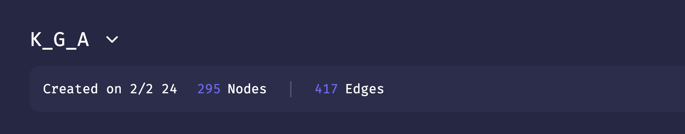
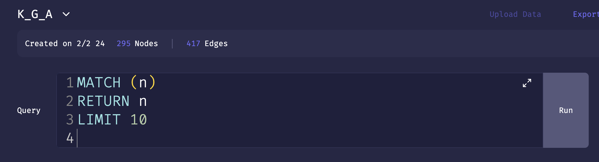
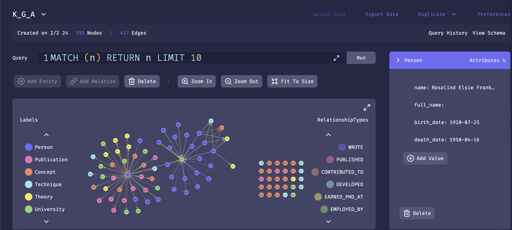
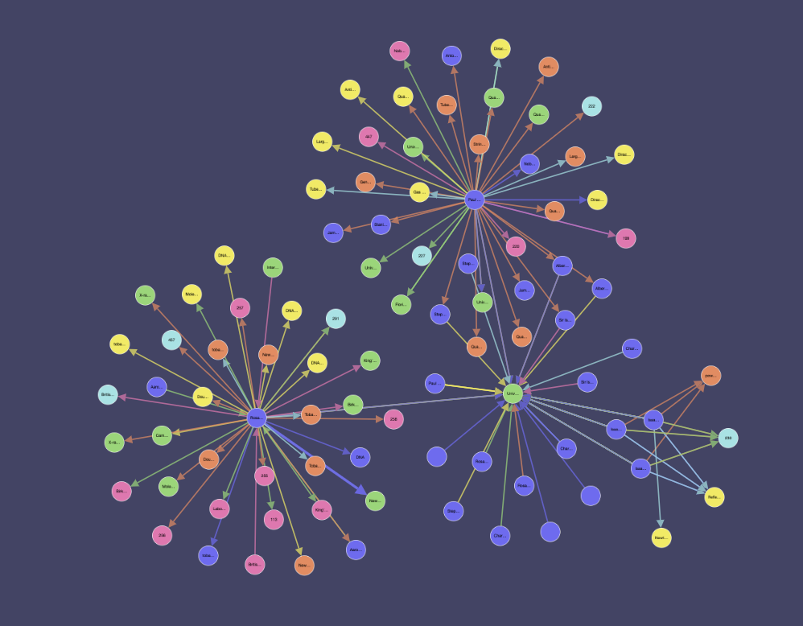

# Knowledge Graph Project with GraphRAG

## Overview

This project implements a Knowledge Graph generator that extracts text from PDF, DOCX, and PPTX files using the GraphRAG SDK and stores the resulting Knowledge Graph in FalkorDB. The application utilizes OpenAI's Generative Model (GPT-4o) to create an ontology from the extracted text, enabling rich querying capabilities.

### Key Features

- **Text Extraction**: Automatically extracts text from various document formats (PDF, DOCX, PPTX) using the `unstructured` library.
- **Ontology Generation**: Leverages OpenAI's GPT-4o model to generate an ontology based on a sample of the extracted text, facilitating structured knowledge representation.
- **Knowledge Graph Creation**: Constructs a Knowledge Graph using the GraphRAG SDK, which allows for efficient storage and retrieval of the generated knowledge.
- **Integration with FalkorDB**: Stores the created Knowledge Graph in FalkorDB, providing a robust and scalable backend for managing graph data.
- **Interactive Chat Interface**: Implements a chat session to interact with the Knowledge Graph, allowing users to ask questions and receive relevant answers.

## Requirements

Before running the application, ensure you have the following installed:

- Python 3.11 or higher
- Required Python libraries (listed in `requirements.txt`)
- Virtual environment (optional but recommended)

## Installation

1. ### Clone the repository:
   ```bash
   git clone https://github.com/VisionOra/GraphRags---Data-Exploration.git
   ```

### Create a virtual environment

```bash
python -m venv venv
source venv/bin/activate # On macOS/Linux
venv\Scripts\activate # On Windows
```

```bash
pip install -r requirements.txt
```

### Before running the application, update the following

OpenAI API Key: Set your OpenAI API key by replacing the placeholder in the code

Database Credentials: Update the KnowledgeGraph connection parameters with your credentials.

` After that you can Intract with Model and Ask questions Related to Data.`

### Graph Visualization Steps on FalkorDB:

#### Step NO 01 :

Go to this URl
`https://browser.falkordb.com/graph`

- You can see the Number of Nodes and Edges



#### Step No.02 :

Write any Query to access and visuallize your Data after Writing the Query Click on Run.



### Step No.03:

Here You can see the All the Node , Edges and their Relation in the form of Graph and details about the selected node.



